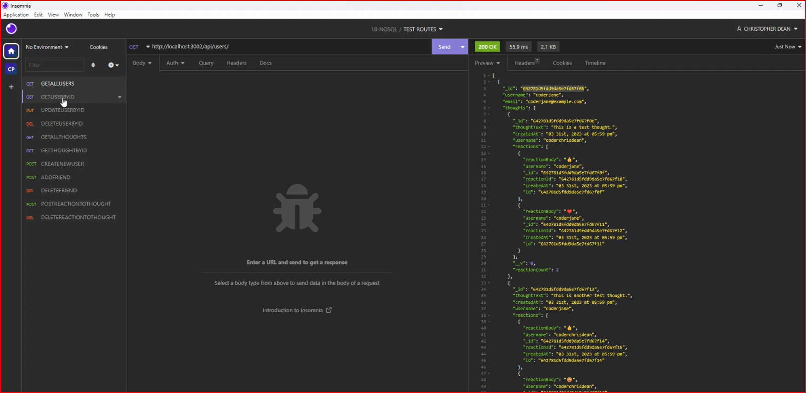

## NoSQL Challenge: Social Network API

## Description

This is a NoSQL API for a social network web application where users can share their thoughts, react to friends’ thoughts, and create a friend list. This application uses Express.js for routing, a MongoDB database, and the Mongoose ODM.

## Table of Contents

* [Installation](#installation)
* [Usage](#usage)
* [Screenshots](#screenshots)
* [Video](#video)
* [Questions](#questions)
* [Link to Repository](#link-to-repository)

## Installation

To install necessary dependencies, run the following command:

```npm i```

## Usage

To use this application, run the following command:

```npm start```

## Screenshots



## Video

[Video of the application]

## Questions

If you have any questions, feel free to reach out to me at coderchrisdean@gmail.com.

## Link to Repository

https://github.com/coderchrisdean/tracked-universe